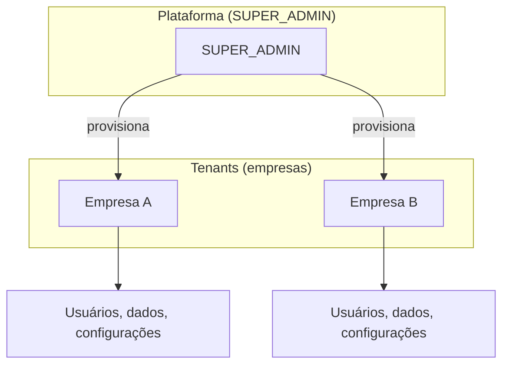
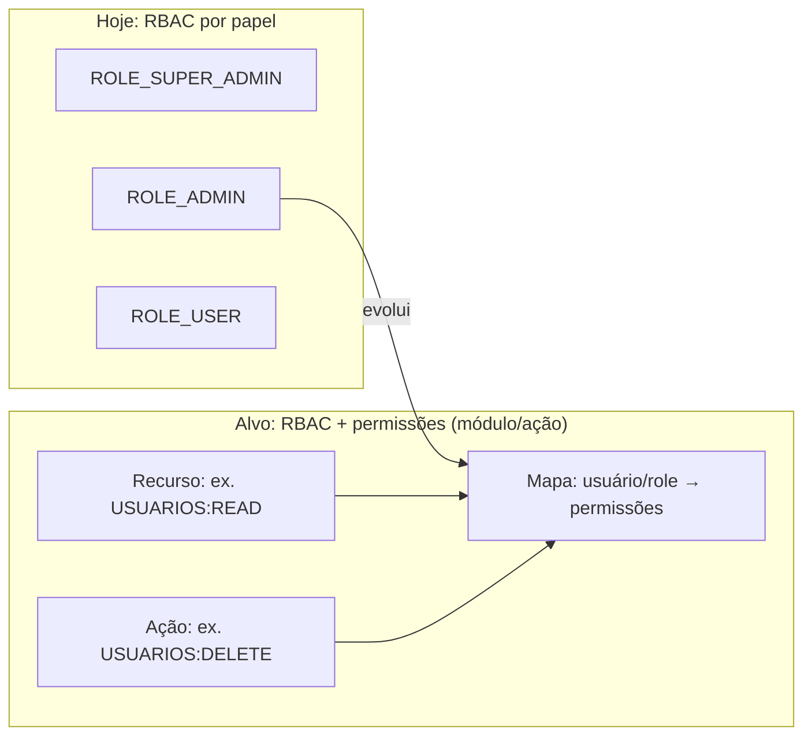
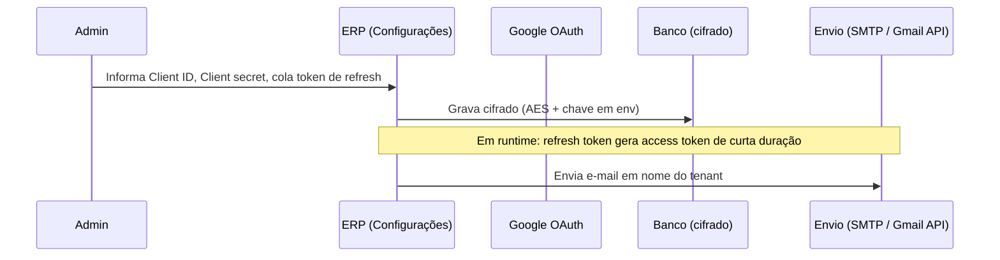
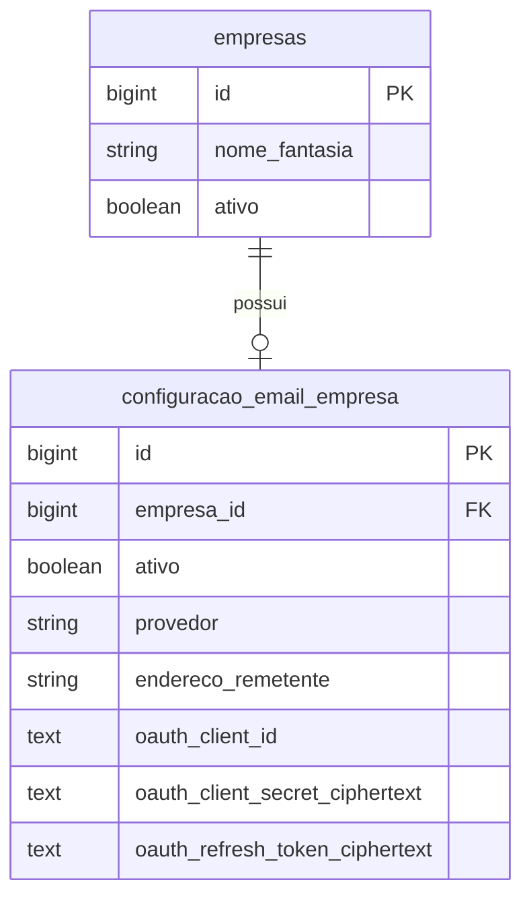

# Arquitetura: permissões granulares, multi-tenant e configuração de e-mail

Este documento descreve o **modelo alvo** (evolução do RBAC atual) e o **fluxo de configuração de e-mail por tenant** (Gmail com OAuth2 / token de refresh).

## 1. Visão geral: camadas

- **Super Admin**: dono da plataforma, escopo global (e gestão de tenants).
- **Tenant (empresa)**: unidade de isolamento; cada um tem `empresa_id` em dados e **configurações próprias** (ex.: e-mail).

## 2. Hoje (fase atual) vs. fase alvo (permissões)

| Conceito | Hoje | Alvo (profissional) |
|----------|------|----------------------|
| Quem acessa o quê | Apenas 3 **papéis** | Papéis **e/ou** catálogo de **permissões** ( strings estáveis, ex. `FATURAMENTO:EMITIR_NFE`) |
| Módulo novo | Ajuste manual em `@PreAuthorize` e menus | Registro de permissão + atribuição a perfis ou usuário |
| Auditoria | Já existe em usuários | Estender padrão para quem ativou qual permissão |

**Implementação típica (próxima fase de produto):**

- Tabelas: `permissao`, `papel_permissao`, opcional `usuario_permissao` (exceção).
- `ErpUserDetailsService` carrega `GrantedAuthority` a partir de `ROLE_*` **e** de `permissao`.
- Controllers: `@PreAuthorize("hasAuthority('USUARIOS:WRITE')")` além de roles quando necessário.

O **módulo de Configurações** descrito abaixo é independente e já nasce **por `empresa_id`**.

## 3. Configuração de e-mail por tenant (Gmail / OAuth2)

Não se armazena "senha do Gmail" em texto plano. O fluxo profissional é **OAuth2**:

- **Client ID / Secret**: vêm do [Google Cloud Console](https://console.cloud.google.com/) (projeto, OAuth client).
- **Refresh token**: obtido após o fluxo de consentimento (uma vez); é o que **persistimos cifrado** para renovar o access token sem interação.
- A **tela atual** de configuração aceita esses três (e remetente); o refinamento "botão conectar com Google" pode ser a próxima iteração (redirect OAuth no ERP).

## 4. Modelo de dados (configuração de e-mail)

## 5. Segurança

- Segredos **nunca** retornam inteiros para o front: apenas máscara (`****`) ou vazio = "não alterar".
- Chave de cifra: `CREDENTIAL_ENCRYPTION_KEY` / `app.secrets.credential-encryption-key` (definir em produção, nunca no repositório).
- **SUPER_ADMIN** escolhe o tenant (`empresaId`); **ADMIN** só vê o próprio `empresa_id`.

---

*Documento alinhado à implementação inicial em `com.erpcorporativo` (módulo Configurações + entidades `Empresa` e `ConfiguracaoEmailEmpresa`).*
